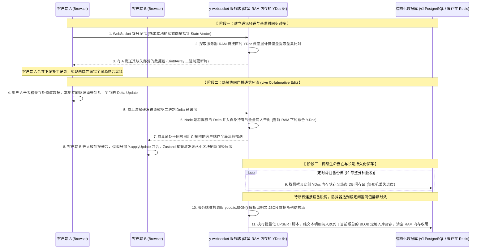

# AIP 可视化组件：协同 DataTable 架构与设计方案

本方案旨在为“约 5000 行渲染 + 20 人实时协同”的数据表组件提供技术栈指引与详细架构设计，以满足数据展示与协同分析的需求。在保留高性能与多点同步的基础上，重点阐述存储机制、虚拟滚动扩展、局部响应式渲染以及自定义交互。

---

## 一、核心技术选型与协议

| 架构层级 | 技术选型 | 功能边界与选型理由 |
| :--- | :--- | :--- |
| **协同引擎与网络传输** | `Yjs` + `y-websocket` | 采用 CRDT（无冲突复制数据类型）算法，基于 WebSocket 多播增量更新，自动合并多端并发修改。 |
| **表格逻辑抽象层** | `TanStack Table` | Headless（无头）逻辑定义库。负责管理排序、过滤、分组、多行映射关系。**遵循 MIT 开源许可协议，完全免费且支持商业化使用。** |
| **视图渲染与长列表** | `TanStack Virtual` | 动态虚拟滚动基建。仅在内存中保留可视区域（约 30-50 行）的实际 DOM 节点，避免由长列表渲染导致的浏览器性能衰减。 |
| **局部响应式通讯层** | `Zustand` (React) | 用于在组件树底层实现对特定变更（如光标移动、单一单元格更新）的细粒度定向重绘（Fine-grained reactivity），隔离根组件重绘。 |

---

## 二、后端持久化与存储双写架构 (Dual-Write)

处理由协同产生的一维 `Y.Array` (行实体为 `Y.Map`) 如何存入数据库，是后端架构设计的关键点。

### 1. 方案比对
* **直接存储原生二进制块 (BLOB)**：将完整 Y.Doc 导出为二进制数组 `Y.encodeStateAsUpdate(ydoc)` 保存。
  * **优势**：读写性能高，完整保留版本历史与由于撤销/重做路径产生的时间向量。
  * **劣势**：存储结构对业务系统不可见。业务层无法应用常规 SQL（如 `SELECT * FROM table WHERE status='TODO'`）进行标准维度的数据查询聚合，存在接口互通壁垒。
* **双重异构写入模式（推荐方案）**：构建冷热分离的双缓存机制结构，满足即时协同和 SQL 级统计。

### 2. 双写同步执行流程
1. **热数据协同区（BLOB 态）**：只要有活跃连接存在，数据增量补丁（Delta）即通过 Node.js 网关在内存池广播并完成状态树合并。为了预防网关异常重启，该实例需配置定时保存（如每分钟执行一次持久化）。
   * **存储介质建议 (Redis vs PostgreSQL)**：若平台中处于活动期的协同表格（频道房间）基数庞大或访问读写频率极高，更建议采用 Redis 等高吞吐 KV 内存数据库承接这类临时缓冲写入，以卸去主数据库负担；若系统初建访问量可控，且为降低运维架构的复杂性，直接将二进制 `Y.Doc` 转存插入现有的 PostgreSQL 数据库（使用 `bytea` 类型字段）也是合理且具有可行性的方案。
2. **冷数据持久化落盘（JSON 态）**：通过设定防抖时效（例如：侦测到 5 分钟内无任何写操作或同屋用户均已离线离场），Node.js 服务端主动调用 `yTable.toJSON()` 解析出明文 JSON 对象数组。底层触发对应数据表的批量 `UPSERT` 动作，将结构化数据精准插入 PostgreSQL/MySQL 的数据表列中，满足后续系统的检索计算及下钻分析调用。对应关联的一个 BLOB 字段也同步更新，用于下一次环境的快速唤醒。

---

## 三、功能模块边界实现与自定义扩展设计

### 3.1 排序与过滤逻辑拦截层 (Sort & Filter)

系统必须执行严谨的状态分割：**用户的过滤、排序条件仅在客户端作为私有局部状态 (Local State) 保存**，不参与公网同步。

* **性能损耗评估**：在现代 V8 引擎内，对 5000 条常规对象级阵列执行跨列模糊匹配 (Filter) 与快排 (Sort)，纯时钟消耗通常稳定在微秒或几毫秒级。本地主线程承接相关操作完全可达到顺滑帧率，应避免发送网络请求交由服务端代为计算。
* **数据修改回调下的回溯寻址实现**：
  在应用 TanStack Table 时，本地排序或过滤会打乱流行的视图展示序列。这要求不能直接使用数组索坐标引下探编辑数据。
  1. 通过实例化配置 `getRowId: originalRow => originalRow.get('id')` 给定唯一键锚点，要求每条初始记录具备不可变 UUID。
  2. 当发生编辑拦截事件（例如 OnChange）时，通过底层回调参数提取该单元格行对应的引用指针：`row.original`。
  3. 执行 `row.original.set('columnKey', newValue)`。该操作通过 `row.original` 原生指针直接指向对应 Yjs 实例修改，网络端发送的是精准指代对应源对象的操作补丁。这种方式不会与自身本地或远端当前任意界面的排序状态发生串台写错的情况。

### 3.2 动态测量虚拟滚动引擎 (Grouping)

当在前端执行“按列分组 (Group by Column)”特性后，线性数组变种为夹带子行 (`subRows`) 及分组头部标题栏 (`Group Header`) 的嵌套形数据。

* **固定高度机制失效化**：分组功能附带收起/展开面板特性。传统虚拟化通过预设每一行的固定高度去推演视图整体的滚动坐标长度；若用户突然折叠掉含有数百条记录的庞大分组区域，表格总高度与物理坐标系将产生极大缩减。传统方法将致使留白框及右侧全局滚动条比例跳变失效。
* **动态重测方案 (Dynamic Size Measurement)**：必须挂载兼容重测绘引擎的配置：
  1. 向组件初始化方配置近似通用预估尺码（如 `estimateSize={() => 40}`），建立渲染前的基础占位基线高度。
  2. 在每一条渲染的根级行标签（如 `<tr>` / `<div>`）上绑定回调探针句柄：`ref={rowVirtualizer.measureElement}`。
  3. 底层将利用浏览器的 ResizeObserver 进行监控反馈。当行元素由于内部或操作原因发生宽高度变化跳变时，框架自动探知当前视图层内渲染出的实际尺寸大小，从而实施动态平移偏差更新消除滚动条跳跃感。

### 3.3 自定义 Cell 计算逻辑操作扩展 (Custom Cell Operations)

部分高级别应用场景中，单元格不能只满足基础内容编辑输入，还需执行第三方复杂公式、调取出窗页面或发起业务相关校验。

* **UI 交互解耦流程**：该类扩展操作操作应当通过“局域弹框或模态窗（Popover / Modal）”机制隔绝交互状态。
  1. 单元格组件渲染为一个触发区域块（比如文字外加可交互的图标形式 `Button`）。
  2. 点击操作激发对应的 React Portal 层界面。
  3. **计算期状态隔离**：在业务逻辑界面处理步骤或验证的各个“中间修改态”，一律托管由组件私有的 React State 闭环执行，**其过程严禁修改并写入 Yjs 远端数据池中**，因而不会引起同步网络并发无用消息从而对其他人视角造成无端干扰跳动。
* **计算闭环写回机制**：
  当客户在表单浮层中成功验证或确认结果提交后，提取对应格式化的数值返回值。最终依循系统规范执行 `row.original.set('column', computedResult)` 将其存入对应 Yjs 数据块中。借由其产生的唯一一次确定性状态包变动完成频道同步刷新。

### 3.4 基础行列管理机制 (Add / Remove Rows)

底层行列阵列操作下放为 CRDT 工具代理执行：
* **新增项操作**：客户端调用 `yTable.insert(index, [new Y.Map()])` 插入新建空类型字典格式。底层通过通道广播剩余协同机器补足当前位置项。
* **删除流程的容错闭环**：发出 `yTable.delete(index, 1)` 后，若其余使用者正在该对应行的某个格子输入数值内容。Yjs 合并引擎会自动将这种失去关联父对象主体的下级键值修改动作归类为“无附带对象的孤立操作”，安全作废从而切除了因类似执行 `undefined.set()` 而容易诱发页面红框报错的前端应用崩溃情景。

### 3.5 Awareness 状态通信 (协同光标雷达构建)

在复杂多方会审的大规模数据修改情境下，显示使用者各自的光标选中范围是防范冲突复写的重要外显功能，此机制依托核心模块内的 `Awareness` 通信组件建立连接。

* **通讯性质及流转闭环**：在通过 `y-websocket` 完成连通过程中，程序默认在旁搭载了一条与主体数据传输隔离的、非持久化的（且仅运行置留于内存当中的）轻量化 UDP 会话层 (Awareness Socket)。
* **广播报文形式**：
  客户端局部鼠标获取焦点或点开编辑栏时。通过其派发状态变动包向局域公屏广播该时点客户端所在的坐标点位及身份识别代号。例如广播该结构：`{ cursor: { rowId: '...', colId: 'status' }, user: { name: 'Lucas', color: '#ff0000' } }`。
* **渲染屏蔽约束设定 (非常重要)**：
  由于公屏随时接收不同个体的变化波段，万不可于 `Table` 高层级视图挂载接收渲染此动态对象，借以防范单个使用者的频发移动带来的大面积深度比较。实施方案是配合引入的状态代理机（如 Zustand）存储隔离收拢光标序列；并在最局域化细碎的底层原组件标签 `<Cell id="row-123-status">` 使其单一侦听属于自己标识的片段。一旦与侦测包吻合，才赋予该特定单元框特定的外包络线描边效果强化视觉 `<div style="outline: 2px solid Color" />`。
* **防残留心跳检测**：为避免用户异常失联所导致最后发出的状态定格成无效“死标识僵尸框”，协议内置规定了一个探测间隔。当对点用户持续几十秒无法再进行状态宣告发送后，网络本地存留队列自动抹除并进行视图卸装动作清理屏幕组件。

---

## 附录：核心技术栈与概念补充说明

在此列举本项目构成“高性能与强协作”底座的三个底层依赖与实施解析。

### A. Yjs 与 y-websocket (CRDT 无冲突协同引擎)
**核心概念**：
Yjs 是目前前沿的纯 JavaScript CRDT（无冲突复制数据类型）实现体系之一。传统架构中为了确保不盖档修改（常见如多人开启同一份共享 Excel），极度依赖于后端锁（排队轮询）。而 CRDT 将这一控制权下放：它允许所有的客户端先离线本地修改，当重新接触网络后依靠一种“数学拓扑算法 (向量时钟)”进行各自编辑节点的有序归并及逻辑排序。因此它保障了系统在“零后端裁决”下能最终展现彻底一致、不出差错的终端视图结果。

**WebSocket 服务器的 Y.Doc 内存托管与入库关系说明**：
* **服务端为何需要存储且保存在哪？** 是的。Node.js 的 `y-websocket` 网关不仅扮演消息转发信使通道，更重要的功能是：**在 Node 进程的服务器内存（RAM）中，完整持有一份当前活跃频道的 Y.Doc 活体副本结构库**。
* **与后续 DB 持久落盘的关系推演**：因为 Node.js 服务器内存是易蒸发的（系统宕机或断电即消失），此前的两套 DB 架构正是为了对内存副本进行抢救备份：
  * **热同步与容灾**：WebSocket 一方面不断吸收客户端 Delta 并缝合进自己的 RAM Y.Doc 服务连接端，另一方面需要通过外置进程，每分钟把这块纯内存的数据抓取出全量二进制快照，丢向 Redis/PostgreSQL。目的保证就算网关崩溃掉线，重启后瞬间能读取最后一分钟前保存的快照重现组建 RAM 本体，无损接管重连。
  * **结构化落网接缝**：伴随所有成员退出，由于不需要再维护通讯，网关会将内存中的该 Y.doc 解析转换为干净的业务 JSON 行表，并最终提交给 PostgreSQL 彻底写死。释放该次内存服务生命周期进程。

**WebSocket 连接同步典型流程图解**：


### B. TanStack Table (逻辑计算控制中枢)
**核心概念**：
这款衍生于前身 react-table 的数据表格生态，区别于诸如 Ant Design / Element UI 最大的差别是它是绝对的 **Headless UI（无头逻辑控制库）**。其完全没提供半点 CSS 格式与基础网页元素，它纯粹提供并管理如翻页定位、筛选引擎驱动、树形排布以及虚拟列控制的数据推演黑盒引擎。

**它的主要功能大盘与处理边界：**
1. **跨字段排序与多路组合 (Sorting)**：不局限于基础的升降顺排，支持设立优先级的跨列级联逻辑排序架构。
2. **多面过滤搜索 (Filtering)**：内嵌开箱即用的通用格式过滤器计算，且兼容开发者下放更为极其复杂的表达式自定义校验。
3. **数据分组嵌套聚合 (Grouping & Aggregation)**：根据特定相同列元素自动压缩阵列形成树状上下级目录结构。且能在外层对这些被嵌套遮盖的内行字段执行 SUM、Avg 平均数等聚合算子汇总。
4. **全端分页管控 (Pagination)**：即兼容从几干条大包直接本地缓存端侧翻页控制策略，也可对接基于 API 光标流的后端拉取分页机制控制态。
5. **列粘滞阻栏 (Pinned/Sticky Column)**：内置了极其稳固的锁列系统，它会自动算准那些需要始终驻留在左侧与右边缘的固定行列坐标及其滚动漂移锚点。

**基础使用用例模型参考**：
```tsx
import { useReactTable, getCoreRowModel } from '@tanstack/react-table';

// 在使用中组件主要关注逻辑提取而不是被强绑定特定封装
function CoreDataTable({ inputData, inputColumns }) {
  // 构建只处理虚拟数据的驱动实体实例
  const tableInstance = useReactTable({
    data: inputData,
    columns: inputColumns,
    getCoreRowModel: getCoreRowModel(), 
  });

  // 渲染时将 TanStack 分发推算好的逻辑状态手工贴合进入原生 DOM
  return (
    <table>
      <thead>
        {tableInstance.getHeaderGroups().map(groupData => (
          <tr key={groupData.id}>
            {groupData.headers.map(header => (<th key={header.id}>{/* 输出名称 */}</th>))}
          </tr>
        ))}
      </thead>
      <tbody>
        {tableInstance.getRowModel().rows.map(rowRef => (
          <tr key={rowRef.id}>
            {rowRef.getVisibleCells().map(cell => (<td key={cell.id}>{/* 内部格数据渲染 */}</td>))}
          </tr>
        ))}
      </tbody>
    </table>
  );
}
```

### C. Zustand (微型 React 状态挂载)
**什么是 Zustand？它做什么？**
Zustand （德语发音意为“状态”）是一个极轻量、快速且纯基于 React Hook 驱动的状态模型方案。它通过一套闭包单例，开辟出游离在由上至下 React 视图体系外的一间“黑盒数据屋”。组件间想要传值或通信，不必再采用极其别扭繁重的父传子链条或重包囊 Context。

**在同类选型当中的优势对比**：
1. **相比于 Redux / RTK**：剔除掉了令人绝望的 `Actions`、`Reducer` 与 `Dispatch` 等外包模板教条文件，且完全没有在最外层包裹 `<Provider>`。开发者能像用基础 JS 那般利用方法改值与抽值，学习接入成本呈断崖式降低且其本体模块包极小。
2. **相比于 React 官方 Context API**：Context 存在致命痛点——它极易造成“连锁反应穿透重绘”。假如我们在 Context 包里存入上百人的定位数据包。即使是最底下的某子元素只提取了一个单人的位置信息，只要这百人包发生了一处改变。Context 就会强制这整个视图重绘而引发深度的页面拖动卡死。Zustand 内拥有一种智能 Selector（选择挂钩），譬如本例协同方案所采用的：单调特定只取 `useStore(state => state.cursors[myCellId])`。当其他光标有任何变动跑跳，只有这一个特定区域才会发生局部画面更新抗压保护。
3. **相比于 MobX**：MobX 的哲学系构建是一类面向对象式的强数据劫持（Proxy 数据绑定魔法），深层次逻辑存在黑盒情况。而 Zustand 的基础逻辑立足于 Immutable（不可更改性数据覆盖源）并保持组件显式取值，高度吻合 React 这几年的数据开发纯函数风向体系，避免由于双向魔法数据导致的修改栈错位 Bug。
