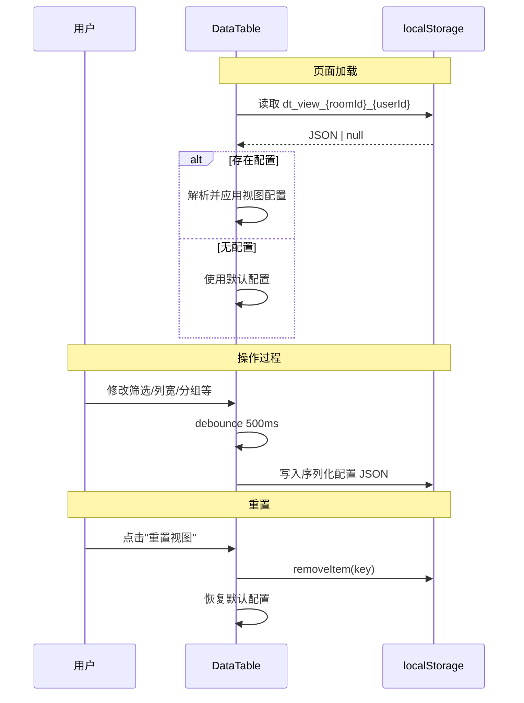

# PRD: DT-C11 视图配置持久化

## 1. 项目背景
*   **Story ID**: DT-C11
*   **Brief**: 视图配置持久化
*   **Description**: 作为用户，我需要在刷新页面后恢复上次的筛选、分组、列宽等视图配置，避免每次重新设置。
*   **依赖**: DT-C3 (筛选/分组)、DT-C9 (列宽/列序/隐藏/冻结)、DT-C10 (条件高亮)

## 2. 核心流程 (Workflow)

### 自动保存
1. 用户修改任一视图配置（filter / group / 列宽 / 列隐藏 / 列顺序 / col freeze / conditional highlight）
2. 系统 debounce 500ms 后自动将当前配置 JSON 序列化并写入 `localStorage`
3. Key 格式：`dt_view_${roomId}_${userId}`

### 自动恢复
1. DataTable 组件 mount 时检查 `localStorage` 中是否存在匹配 key
2. 若存在 → 解析 JSON → 用于初始化各 State（filter / group / columnOrder / columnSizing / frozenCount / conditionalRules）
3. 若不存在或解析失败 → 使用默认配置

### 重置视图
1. 用户点击工具栏"重置视图"按钮
2. 清除 `localStorage` 中对应 key
3. 所有视图配置恢复为 `ColumnDef` 定义的默认值



## 3. 验收标准 (Acceptance Criteria)

| ID | 描述 | 优先级 | 验证方式 | 状态 |
|:---|:---|:---|:---|:---|
| AC-11.1 | 修改筛选/分组/列宽/列隐藏/冻结/条件高亮后刷新页面，配置自动恢复 | P0 | 功能测试 | Pending |
| AC-11.2 | 存储 key 以 `roomId + userId` 隔离，不同房间/用户互不影响 | P0 | 隔离测试 | Pending |
| AC-11.3 | 点击"重置视图"后，所有配置恢复默认且 localStorage 中对应 key 被清除 | P0 | 功能测试 | Pending |
| AC-11.4 | localStorage 数据损坏时（手动篡改/schema 变更），graceful fallback 到默认配置，不报错 | P1 | 健壮性测试 | Pending |
| AC-11.5 | 配置写入频率 ≤ 2次/秒（debounce 500ms） | P1 | 性能观察 | Pending |

## 4. 技术规格 (Tech Spec)

### 持久化数据结构
```typescript
interface PersistedViewConfig {
  version: number;                              // Schema 版本号，用于未来迁移
  filters: FilterCondition[];                   // 筛选条件
  groupBy: string[];                            // 分组列 ID
  columnOrder: string[];                        // 列顺序
  columnSizing: Record<string, number>;         // 列宽
  columnVisibility: Record<string, boolean>;    // 列可见性
  frozenColumnCount: number;                    // 冻结列数
  conditionalRules: ConditionalRule[];          // 条件高亮规则
}
```

### 关键设计
*   **版本迁移**: `version` 字段确保未来 schema 变更时可执行 migration
*   **自定义 Hook**: `useViewPersistence(roomId, userId)` 封装读/写/重置逻辑
*   **Debounce**: 使用 `useDebouncedCallback` 避免频繁写入

## 5. 范围边界 (Scope)
*   **In-Scope**: localStorage 持久化、自动保存/恢复、重置按钮、版本控制
*   **Out-of-Scope**: 服务端持久化 (可作为后续升级)、视图"命名保存"（如 "我的视图1"）、视图分享给其他用户
