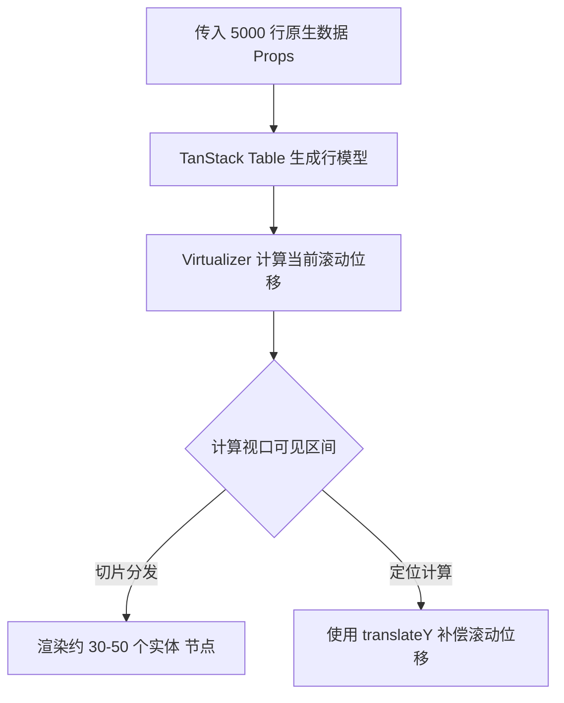

# PRD: DT-C1 虚拟滚动渲染基础框架

## 1. 需求背景
DataTable 需要处理最高 5000 行的研发数据展示。为了确保高频率交互下的流畅度，必须引入虚拟滚动技术，仅渲染当前视口可见的 DOM 节点。

## 2. 功能描述
* **虚拟化适配**: 集成 `TanStack Virtual`，实现基于视口偏移量的行渲染。
* **动态行高支持**: 引入动态测量机制，解决由于分组折叠或单元格内容溢出导致的行高变化问题。
* **首屏性能优化**: 优化渲染启动链路，确保 5000 行级别数据下的首屏出图耗时受控。

## 3. 验收标准
| ID | 描述 | 优先级 | 验证方式 |
|---|---|---|---|
| AC-1.1 | 5000 行全量数据下，LCP（最大内容渲染）耗时 ≤ 300ms。 | P0 | 性能监测工具 |
| AC-1.2 | 滚动时 <tbody> 内活跃的 DOM `<tr>` 数量稳定在常量范围内（如 ≤ 50 个）。 | P0 | DOM 树节点探针 |
| AC-1.3 | 高速滚动过程中，不出现明显的白屏等待期（白屏时间控制在 2 帧内）。 | P1 | 帧率监测 |
| AC-2.1 | 容器尺寸发生变化时（如浏览器缩放），表格应自适应重绘虚拟布局。 | P1 | ResizeObserver 测试 |

## 4. 技术逻辑
* **渲染链路**:

## 5. 注意事项
* **组件复杂度限制**: 虚拟滚动在频繁挂载/卸载重型 React 组件（如复杂图表）时依然会有性能损耗。应尽量保持单元格组件的轻量化。
