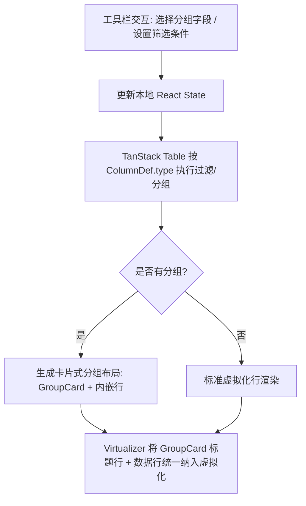

# PRD: DT-C3 高级筛选与卡片式分组

## 1. 需求背景
DataTable 在协作场景下，用户需要对数据进行独立的排序、筛选和分组操作。这些操作应仅影响当前用户视图，不触发网络同步。本次增强重点包括：
- 将分组控件从表头移至工具栏，以下拉选择器形式呈现
- 筛选条件根据列类型自动适配控件
- 分组视觉采用飞书多维表格风格的卡片式布局

## 2. 功能描述

### 2.1 排序
* 支持列头点击排序（单列 / 多列 Shift+Click）
* 排序逻辑根据 `ColumnDef.type` 自动选择数值排序或字典序排序

### 2.2 高级筛选

#### P0: 单字段条件筛选
用户点击工具栏"筛选"按钮，展开筛选面板：
1. 选择筛选字段（仅显示 `filterable: true` 的列）
2. 根据列类型自动渲染对应的条件控件：

| 列类型 | 筛选控件 | 筛选逻辑 |
|---|---|---|
| `string` | 文本输入框 | 包含 / 不包含 |
| `number` | 双端数值输入 (min-max) | 范围内匹配 |
| `enum` | 多选 Checkbox 列表 | 值包含于选中项 |
| `date` | 日期范围选择器 | 时间范围内匹配 |

#### P1: 多条件组合筛选 (🔲 Backlog)
* 支持添加多个筛选条件（目前实现为默认 AND 逻辑叠加）
* 条件之间支持 AND / OR 逻辑切换（**未实现**）
* 每个条件可独立删除（**未实现专门的删除按钮，目前通过清空值间接生效**）

### 2.3 卡片式分组

#### 交互
* 分组控件位于顶部工具栏，包含两个级联下拉选择器（分组 1 / 分组 2）
* 仅 `groupable: true` 的列出现在下拉选项中
* 最多支持两层嵌套分组

#### 视觉风格（参考飞书多维表格）
* 每个分组渲染为一个带圆角的卡片区块
* 卡片标题栏包含：
  * 折叠/展开箭头
  * 分组字段值（`enum` 类型显示为 Badge）
  * 记录数统计
* 卡片内部保持标准表格列结构
* 卡片之间有 12px 间距
* 嵌套分组时子卡片缩进 24px

## 3. 验收标准
| ID | 描述 | 优先级 | 验证方式 |
|---|---|---|---|
| AC-1.1 | 筛选面板根据列类型正确渲染对应的条件控件。 | P0 | UI 交互测试 |
| AC-1.2 | 对 5000 行执行多列复合排序，计算反馈耗时 ≤ 50ms。 | P0 | 计时分析 |
| AC-1.3 | 所有筛选/排序/分组操作不产生网络同步 Payload。 | P0 | 通信黑盒测试 |
| AC-2.1 | 分组以卡片形式展示，卡片内保持标准列对齐。 | P0 | UI 视觉验证 |
| AC-2.2 | 两层嵌套分组正确渲染，子卡片缩进显示。 | P0 | 布局测试 |
| AC-2.3 | 分组折叠/展开时虚拟滚动高度自动修正。 | P0 | 布局边界测试 |

## 4. 技术方案

## 5. 风险说明
* **卡片 + 虚拟化兼容**: 分组卡片的标题行需要作为特殊的虚拟行参与高度计算。两层嵌套时虚拟化的复杂度显著上升，需要仔细处理展开/折叠时的偏移量重算。
