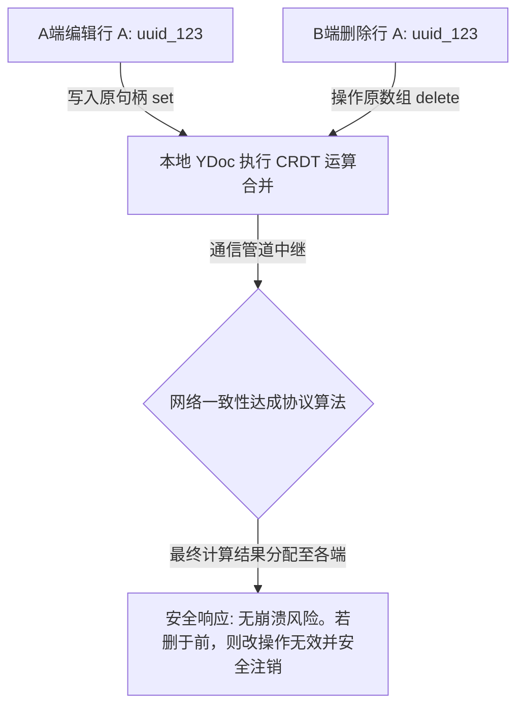

# PRD: DT-C4 Yjs CRDT 并发数据合并与同步处理机制

## 1. 需求背景
为支持多人同时实时编辑，必须引入 CRDT（无锁并发合并）算法。该机制能解决由于操作并行导致的顺序冲突问题，确保数据最终一致性。

## 2. 功能描述
* **Yjs 全深度集成**: 替换表格前端维护的原生嵌套数组，直接以 Y.Array 作为核心数据源。
* **增量状态同步**: 完成由 WebSocket 驱动的 Uint8Array 状态同步流集成。
* **引用追踪更新**: 编辑操作不依赖 Table Index，而是通过 UUID 直接钩取 `row.original` 原始数据节点。

## 3. 验收标准
| ID | 描述 | 优先级 | 验证方式 |
|---|---|---|---|
| AC-1.1 | 单元格修改操作仅产生对应字段的增量补丁包，禁止全表覆盖式更新。 | P0 | 流量包差异化分析 |
| AC-1.2 | 在两人同时对同一处记录执行“改”与“删”操作的冲突测试中，系统需自动收敛，不报 JS 崩溃错误。 | P0 | 并发极端路径测试 |
| AC-2.1 | 数据同步平均网络端到端时延（含两端渲染时间）控制在 ≤ 150ms。 | P1 | 毫秒级网络链路测试 |

## 4. 技术实现

## 5. 风险提示
* **信令压力**: 极高并发下的微小变更发包频率过高可能超出单机网关承载。业务侧需针对房间活跃度设定准入阈值或进行连接隔离。
