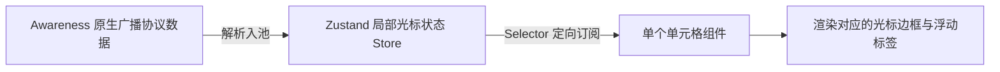

# PRD: DT-C5 协同状态感知系统 (Awareness)

## 1. 需求背景
为增强办公协同体验，用户需要了解当前房间内其他人的实时动向（如正在选中哪个单元格），以防冲突修改和提高信息同步效率。

## 2. 功能描述
* **状态广播**: 基于 Yjs 的 Awareness 协议，实时上报当前用户聚焦的行、列坐标。
* **视图指示**: 在对应的 UI 组件上层绘制其他协作者的彩框和人名标签。
* **防抖订阅**: 引入 `Zustand` 作为中间状态层，确保光标的高频跳动不触发非利益相关单元格的无效重绘。

## 3. 验收标准
| ID | 描述 | 优先级 | 验证方式 |
|---|---|---|---|
| AC-1.1 | 多端对接测试：操作端点击某单元格，异地端需在 200ms 内对应出现该处高亮渲染。 | P0 | 可视化交互对验 |
| AC-1.2 | 离线自动清理：强制断开某端网络后，其他端页面上属于该用户的光标需在 ≤ 60 标称心跳秒内自动消失。 | P1 | 异常链路断开测试 |
| AC-2.1 | 性能合规：进行光标移动测试时，使用 Profiler 观测表格整体渲染消耗，单方单元格重绘不波及整体 Table 树。 | P0 | 渲染隔离监测 |

## 4. 技术细节
* **状态流向**:

## 5. UI/UX 效果建议
* **标签样式**: 使用微缩浮动标牌（约 12px 字体），背景色由系统为每个 Client 分配的随机高饱和色填充，并支持文字反色显示。
