# PRD: DT-C7 列类型定义系统

## 1. 需求背景
作为一个可复用的 React 组件库，DataTable 的列定义必须完全由外部宿主通过 Props 配置，而不是内置写死。引入列类型系统后，组件可以根据类型自动驱动排序逻辑、筛选控件和编辑控件的选择，减少宿主的接入成本。

## 2. 功能描述

### 2.1 类型化列定义接口
组件通过 `columns: ColumnDef[]` Props 接收列配置，每列必须声明 `type` 字段。

```typescript
type ColumnType = 'string' | 'number' | 'enum' | 'date';

interface ColumnDef {
  id: string;
  header: string;
  type: ColumnType;
  width?: number | string;
  editable?: boolean;        // 默认 true
  sortable?: boolean;        // 默认 true
  groupable?: boolean;       // 默认 true
  filterable?: boolean;      // 默认 true
  
  // enum 专属配置
  enumOptions?: { label: string; value: string; color?: string }[];
  
  // number 专属配置
  numberRange?: { min?: number; max?: number; step?: number };
  
  // date 专属配置
  dateFormat?: string;
  
  // 自定义编辑器（覆盖默认）
  cellEditor?: (ctx: EditorContext) => React.ReactNode;
}
```

### 2.2 类型驱动行为

| 行为 | string | number | enum | date |
|---|---|---|---|---|
| **排序** | 字典序 (`localeCompare`) | 数值排序 | option 定义顺序 | 时间戳排序 |
| **查看态** | 文本 | 数字 | Badge/Tag | 格式化日期 |
| **编辑态** | `<input text>` | `<input number>` | `<Select>` | DatePicker |
| **筛选** | 包含/不包含 | min-max 范围 | 多选 checkbox | 日期范围 |

### 2.3 枚举类型增强
* `enumOptions` 中可指定 `color`，用于在查看态渲染彩色 Badge
* 编辑态下拉选择器的选项列表自动由 `enumOptions` 填充
* 筛选面板中显示为多选 checkbox 列表

## 3. 验收标准
| ID | 描述 | 优先级 | 验证方式 |
|---|---|---|---|
| AC-1.1 | 列定义完全由外部 Props 传入，移除 `columns` Props 后组件不渲染任何列。 | P0 | 接口测试 |
| AC-1.2 | `string` 类型列双击显示文本输入框，`number` 类型显示数字输入框。 | P0 | UI 交互测试 |
| AC-1.3 | `enum` 类型列双击显示下拉选择器，选项与 `enumOptions` 一致。 | P0 | UI 交互测试 |
| AC-2.1 | `enum` 类型在查看态显示为彩色 Badge（如 `color` 已配置）。 | P1 | 视觉验证 |
| AC-2.2 | `number` 类型列的排序为数值排序而非字典序。 | P0 | 数据验证 |

## 4. 技术方案

### 4.1 核心组件 Props 变更
```typescript
// 变更前
<CollaborativeTable room={roomId} currentUser={user} />

// 变更后
<CollaborativeTable 
  room={roomId} 
  currentUser={user}
  columns={columnDefs}     // 必传
/>
```

### 4.2 ReactiveCell 类型适配

```mermaid
graph TD
    A["ReactiveCell 接收 columnDef"] --> B{"columnDef.type?"}
    B -->|string| C["查看: <span> / 编辑: <input text>"]
    B -->|number| D["查看: 数字格式化 / 编辑: <input number>"]
    B -->|enum| E["查看: <Badge color={opt.color}> / 编辑: <Select options={opts}>"]
    B -->|date| F["查看: 格式化日期 / 编辑: DatePicker"]
    B -->|有 cellEditor| G["编辑: 自定义 Portal 组件"]
```


## 5. 注意事项
* 列类型系统是纯前端的 UI 行为驱动，不影响 Yjs 底层的数据存储格式（始终为 `Y.Map<string>`）。
* `date` 类型在 P0 阶段可简化为文本输入，DatePicker 组件可在后续迭代引入。
