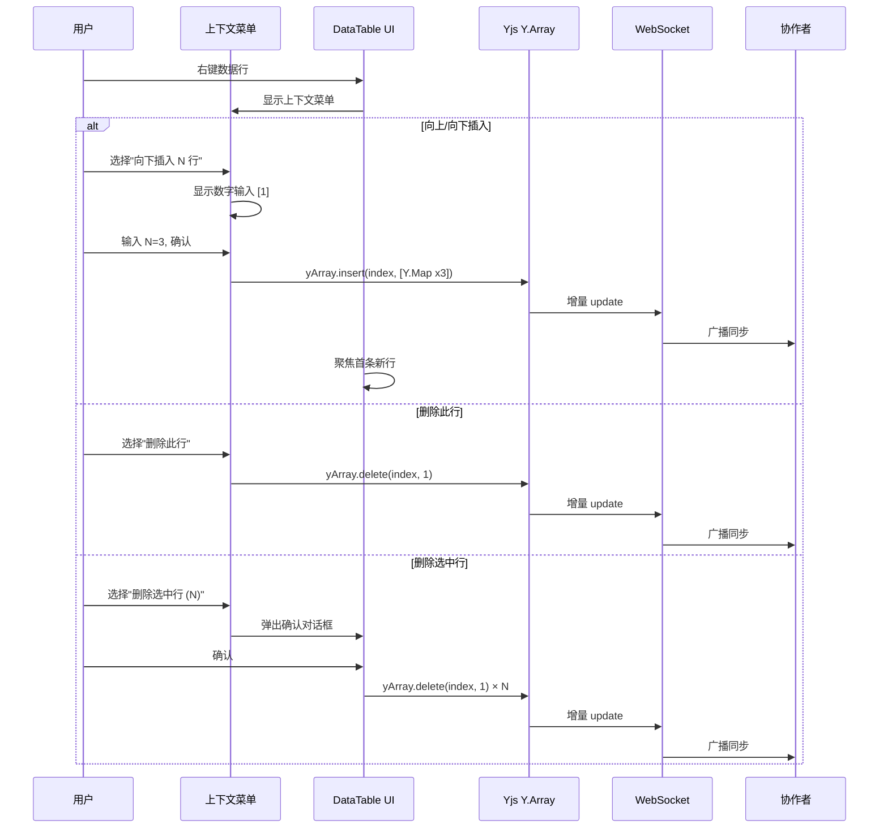

# PRD: DT-C8 行增删

## 1. 项目背景
*   **Story ID**: DT-C8
*   **Brief**: 行增删
*   **Description**: 作为用户，我需要在表格中增加新行和删除已有行，以便管理数据记录。

## 2. 核心流程 (Workflow)

### 2.1 新增行 — 操作行（Placeholder Row）

表格默认在**数据末尾**渲染一条特殊的**操作行（Placeholder Row）**，作为新增行的入口。

#### 2.1.1 无分组模式
1. 表格数据行末尾始终显示一条操作行
2. 操作行最左侧显示 `+` 圆形按钮，其余 cell 显示为浅灰色虚线占位
3. 用户点击 `+` 按钮：
   - 系统在操作行上方插入一条新数据行，生成唯一 `row_id`（UUID）
   - 新行通过 Yjs `Y.Map` 插入到 `Y.Array` 尾部，自动同步至协作者
   - 焦点自动定位到新行第一个可编辑 cell，进入编辑态
   - **操作行自身下移一行**，始终保持在末尾

#### 2.1.2 分组模式
1. **每个分组（Group）底部**都渲染一条独立的操作行
2. 点击该分组内的 `+` 按钮：
   - 新行插入到该分组的数据末尾（操作行上方）
   - 新行自动继承该分组的分组字段值（如点击"进行中"分组的 `+`，新行的 `status` 自动设为"进行中"）
   - 操作行下移，保持在分组底部
3. 表格最末尾的全局操作行同时保留，点击后插入"未分组"数据

```
┌──────────────────────────────────────┐
│ ▼ 状态: 进行中 (3)                    │
│ ┌────┬──────────┬────────┐           │
│ │    │ 任务标题  │ 负责人  │           │
│ ├────┼──────────┼────────┤           │
│ │    │ 任务A    │ 张三    │           │
│ │    │ 任务B    │ 李四    │           │
│ │    │ 任务C    │ 王五    │           │
│ ├────┼──────────┼────────┤           │
│ │ ⊕  │ ░░░░░░░░ │ ░░░░░░ │ ← 组内操作行
│ └────┴──────────┴────────┘           │
│ ▼ 状态: 已完成 (2)                    │
│ ┌────┬──────────┬────────┐           │
│ │    │ 任务D    │ 赵六    │           │
│ │    │ 任务E    │ 钱七    │           │
│ ├────┼──────────┼────────┤           │
│ │ ⊕  │ ░░░░░░░░ │ ░░░░░░ │ ← 组内操作行
│ └────┴──────────┴────────┘           │
├──────────────────────────────────────┤
│ ⊕  │ ░░░░░░░░ │ ░░░░░░ │ ← 全局操作行
└──────────────────────────────────────┘
```

### 2.2 右键上下文菜单

用户**右键点击任意数据行**时弹出上下文菜单（Context Menu），提供以下操作：

| 菜单项 | 行为 | 说明 |
|---|---|---|
| **向上插入 N 行** | 在当前行上方插入 N 条空行 | 点击后先弹出输入框，默认 N=1，用户可修改后确认 |
| **向下插入 N 行** | 在当前行下方插入 N 条空行 | 同上 |
| **删除此行** | 删除当前右键所在行 | 直接删除，无二次确认（单行操作） |
| ─── 分隔线 ─── | — | — |
| **删除选中行 (N)** | 删除所有已选中行 | 仅在 `selectedRowIds.size > 0` 时显示；弹出确认对话框 |

#### 插入 N 行交互流程
1. 用户右键 → 选择"向上插入 N 行"
2. 菜单项内联显示数字输入控件：`[1] 行` + 确认按钮
3. 用户修改数字（或保持默认 1）→ 点击确认 / 按 Enter
4. 系统在目标位置批量插入 N 条空行，每行生成独立 `row_id`
5. 通过 Yjs 同步至协作者
6. 焦点定位到第一条新插入行的首个可编辑 cell



### 2.3 删除行
*   **单行删除**：右键 → "删除此行"，直接执行，无二次确认
*   **批量删除**：右键 → "删除选中行 (N)"，弹出确认对话框："确认删除 N 条记录？此操作不可撤销。"
*   删除操作通过 Yjs 实时同步至协作者

## 3. 验收标准 (Acceptance Criteria)

| ID | 描述 | 优先级 | 验证方式 | 状态 |
|:---|:---|:---|:---|:---|
| AC-8.1 | 表格末尾始终显示操作行，点击 `+` 后 ≤ 100ms 新行可见并进入编辑态，操作行下移 | P0 | UI 交互测试 | Pending |
| AC-8.2 | 分组模式下每个分组底部显示独立操作行，点击后新行插入该分组末尾 | P0 | UI 交互测试 | Pending |
| AC-8.3 | 分组内新增行自动继承分组字段值 | P0 | 功能测试 | Pending |
| AC-8.4 | 新增行立即通过 Yjs 同步到其他协作者窗口 | P0 | 多端同步测试 | Pending |
| AC-8.5 | 右键菜单显示"向上插入 N 行"/"向下插入 N 行"/"删除此行"，批量选中时额外显示"删除选中行" | P0 | UI 交互测试 | Pending |
| AC-8.6 | 插入 N 行时输入框默认 1，支持用户修改数量后确认 | P0 | UI 交互测试 | Pending |
| AC-8.7 | 批量插入 N 行后每行拥有独立 `row_id`，全部通过 Yjs 同步 | P0 | 功能测试 | Pending |
| AC-8.8 | 单行删除（右键"删除此行"）无二次确认直接执行 | P0 | UI 交互测试 | Pending |
| AC-8.9 | 批量删除弹出确认对话框，取消后不执行删除 | P0 | UI 交互测试 | Pending |
| AC-8.10 | 另一协作者正在编辑的行被删除时，该协作者收到 Toast 提示"此行已被删除" | P1 | 冲突场景测试 | Pending |
| AC-8.11 | 操作行不参与排序/筛选/导出，不计入行数统计 | P1 | 边界测试 | Pending |

## 4. 技术规格 (Tech Spec)

### 操作行设计
*   操作行为**虚拟行**（non-data row），不存在于 Yjs `Y.Array` 中
*   标记 `type: 'placeholder'`，在 virtualizer 行列表末尾（或分组末尾）注入
*   分组模式下：遍历 `groupedRows`，在每个 group 的 `subRows` 末尾追加 placeholder 行

### 数据操作
*   **尾部新增**：`yArray.push([new Y.Map()])` — 生成带 UUID 的空行数据
*   **定点插入**：`yArray.insert(index, [new Y.Map() × N])` — 在指定位置插入 N 行
*   **删除**：通过 `row_id` 查找 index → `yArray.delete(index, 1)`
*   **分组内新增**：插入新行时预填分组字段值 → `yMap.set(groupField, groupValue)`

### 右键菜单实现
*   监听 table body 的 `onContextMenu` 事件
*   根据 `event.target` 定位到行 index
*   使用 Radix / shadcn `<ContextMenu>` 组件渲染
*   "插入 N 行" 菜单项内嵌 `<input type="number" min="1" max="100" defaultValue="1" />` + 确认按钮

### 关键设计点
*   **行选择态管理**：使用 Zustand 管理 `selectedRowIds: Set<string>`，不参与 Yjs 同步
*   **并发安全**：两人同时删除同一行 → Yjs CRDT 幂等处理，不会报错
*   **虚拟滚动兼容**：新增/删除后需通知 virtualizer 重新计算行总数

## 5. UI/UX 交互

### 操作行样式
*   背景色：`transparent`（无背景，融入表格）
*   `+` 按钮：24×24px 圆形，灰色描边 → hover 主题色填充
*   占位 cell：浅灰色虚线下划线（`border-bottom: 1px dashed var(--border-muted)`）
*   整行 hover 效果：浅蓝色背景提示可操作

### 右键上下文菜单
*   菜单宽度：220px
*   菜单项图标：向上插入（↑）、向下插入（↓）、删除（🗑）
*   "插入 N 行" 展开时显示内联数字输入 `[1] 行 [确认]`

### 确认对话框（仅批量删除时）
*   标题："删除确认"
*   内容："确认删除 N 条记录？此操作不可撤销。"
*   双按钮："取消 / 删除"（删除按钮红色）

## 6. 范围边界 (Scope)
*   **In-Scope**: 操作行新增、右键上下文菜单、定点插入 N 行、单行/批量删除、分组内新增、Yjs 同步
*   **Out-of-Scope**: 撤销/恢复（Undo/Redo）、行复制粘贴、行拖拽排序

## 7. 待定问题 (Open Questions)
*   删除是否需要软删除（标记删除 + 回收站）？当前方案为硬删除。
*   操作行在导出 CSV/Excel 时是否需要排除？→ 是，操作行为 UI 专属元素。
