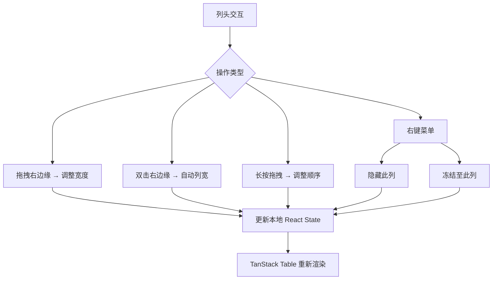

# PRD: DT-C9 列交互管理（列宽/顺序/隐藏/冻结/自动列宽）

## 1. 项目背景
*   **Story ID**: DT-C9
*   **Brief**: 列交互管理
*   **Description**: 作为用户，我需要灵活调整列的宽度、顺序、可见性和冻结状态，以打造适合自己工作流的数据视图。

> [!IMPORTANT]
> 列交互操作为**本地视图状态**，不参与 Yjs 协同同步。每个用户拥有独立的列布局偏好。

## 2. 功能描述

### 2.1 调整列宽
1. 鼠标 hover 列头右边缘 → 光标变为 `col-resize`
2. 拖拽调整宽度，实时预览；释放后生效
3. 约束：最小宽度 60px，无上限

### 2.2 自动列宽
1. 双击列头右边缘 → 该列自动适配内容最佳宽度
2. 工具栏"自动列宽"按钮 → 所有列一次性自适应
3. 计算逻辑：遍历当前可视行（virtualizer 渲染范围），取 `max(header宽度, 内容最大宽度) + 16px padding`

### 2.3 调整列顺序
1. 长按列头 200ms → 进入拖拽模式
2. 拖拽时显示半透明列影子 + 目标位置竖线指示器
3. 释放到目标位置后更新列顺序
4. 冻结列区域不可拖出/拖入

### 2.4 隐藏列
1. 列头右键菜单 → "隐藏此列"
2. 工具栏"列管理" Popover → 列 Checkbox 列表，取消勾选即隐藏
3. 至少保留 1 列可见，否则禁用最后一列的隐藏操作

### 2.5 冻结列 (Col Freeze)
1. 列头右键菜单 → "冻结至此列"：该列及其左侧所有列固定
2. 冻结列固定在表格左侧，水平滚动时不移动
3. 冻结列与非冻结列之间渲染分隔线（1px solid + box-shadow）
4. 再次右键点击 → "取消冻结"



## 3. 验收标准 (Acceptance Criteria)

| ID | 描述 | 优先级 | 验证方式 | 状态 |
|:---|:---|:---|:---|:---|
| AC-9.1 | 拖拽列头右边缘可调整列宽，最小 60px，释放后即时生效 | P0 | UI 交互测试 | Pending |
| AC-9.2 | 双击列头右边缘自动适配该列最佳宽度 | P0 | UI 交互测试 | Pending |
| AC-9.3 | 拖拽列头可调整列顺序，拖拽时显示占位指示器 | P0 | UI 交互测试 | Pending |
| AC-9.4 | 列头右键菜单提供"隐藏列"操作；工具栏"列管理"面板可管理列可见性 | P0 | UI 交互测试 | Pending |
| AC-9.5 | 列冻结后固定在左侧，水平滚动时不移动，冻结线清晰可见 | P0 | 布局测试 | Pending |
| AC-9.6 | 工具栏"自动列宽"按钮一次性调整全部列宽 | P1 | UI 交互测试 | Pending |
| AC-9.7 | 所有列交互操作不产生 Yjs 同步 Payload | P0 | 通信黑盒测试 | Pending |
| AC-9.8 | 冻结列与分组视图共存时，冻结列始终固定且不错位 | P1 | 边界测试 | Pending |

## 4. 技术规格 (Tech Spec)

### State 设计
```typescript
interface ColumnViewState {
  columnOrder: string[];              // 列 ID 排列顺序
  columnVisibility: Record<string, boolean>; // 列可见性
  columnSizing: Record<string, number>;      // 列宽 (px)
  frozenColumnCount: number;          // 冻结列数量（从左起计数）
}
```

### 关键实现
*   **列宽调整**：利用 TanStack Table 内置的 `columnResizeMode: 'onChange'`
*   **列排序**：TanStack Table `state.columnOrder` + DnD 拖拽
*   **冻结列**：通过 CSS `position: sticky; left: Npx; z-index: 2` 实现，累计计算各冻结列偏移量
*   **自动列宽**：创建隐藏的 `<canvas>` 元素，使用 `ctx.measureText()` 测量文本宽度

## 5. 范围边界 (Scope)
*   **In-Scope**: 列宽调整、自动列宽、列顺序拖拽、列隐藏、列冻结
*   **Out-of-Scope**: 列新增/删除（属于 schema 层面变更）、列冻结同步到其他用户

## 6. 待定问题 (Open Questions)
*   冻结列是否需要支持"冻结右侧列"？目前仅支持从左侧冻结。
*   自动列宽在分组折叠状态下，是否基于已展开行？→ 仅基于当前可见行。
