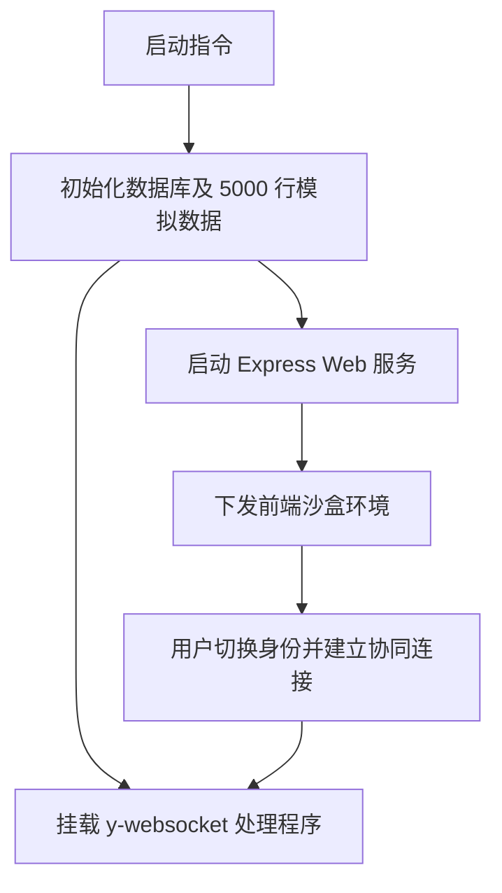

# PRD: DT-D1 Demo 辅助环境与基础设施

## 1. 需求背景
为验证 Collaborative DataTable 组件的并发同步能力，需要搭建一套配套的 Demo 环境。该环境必须包含能够处理二进制同步协议的服务端以及可持久化的测试数据库。

## 2. 功能描述
* **自动化初始化**: 启动 `npm run dev-server` 时，自动检查并初始化含 5000 行数据的本地 SQLite 数据库。
* **数据网关**: 基于 `y-websocket` 实现 Node.js 中继服务，支持 Yjs 协议握手。
* **模拟用户身份**: 前端支持通过下拉菜单切换多组模拟账户，自动签发并存储对应的测试 JWT。

## 3. 验收标准
| ID | 描述 | 优先级 | 验证方式 |
|---|---|---|---|
| AC-1.1 | 执行启动指令后 5s 内完成服务拉起并连接数据库。 | P0 | 启动日志监测 |
| AC-2.1 | `seed.js` 脚本生成的初始数据具有唯一的 UUID，确保精准更新。 | P0 | 数据库记录检查 |
| AC-3.1 | 切换模拟账户后，前端雷达颜色和人员标签应即时更新。 | P1 | UI 交互测试 |
| AC-4.1 | Node 服务端能正确响应 WebSocket 升级请求，并记录客户端连接日志。 | P0 | 通信链路核查 |

## 4. 技术规范
* **架构总览**:

* **核心表结构**:
  | 字段 | 类型 | 说明 |
  |---|---|---|
  | `row_id` | UUID | 数据主键 |
  | `owner` | String | 负责人字段 |
  | `status` | String | 业务状态字段 |

## 5. 风险与遗留
* **并发锁限制**: SQLite 在高频并发写入快照时可能遇到文件锁竞争。若压测性能不达标，建议在 Demo 环境中切换为 PostgreSQL。
