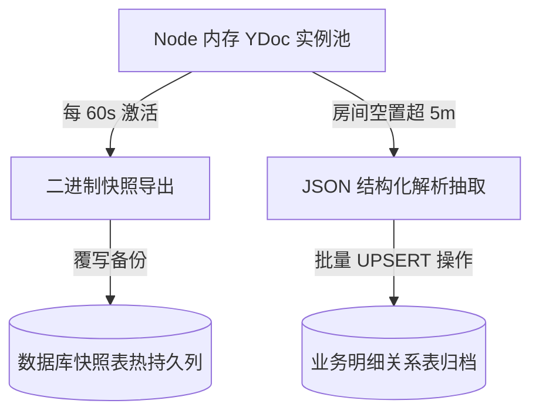

# PRD: DT-D2 服务器端双层持久化策略 (Demo)

## 1. 需求背景
为确保协同数据的安全性，Demo 服务端需设计一套高效且具备容灾能力的存储方案。目前采取内存全量热存 + 数据库定时与异步备份的双重策略。

## 2. 功能描述
* **双环备份架构**:
  * **热快照备份**: 计划任务每隔 1 分钟将内存 YDoc 导出为 Uint8Array 二进制包，并全量覆写到数据库的 `room_snapshots` 表中，应对进程崩溃。
  * **冷结构化归档**: 捕捉房间闲置信号（无人在场）；满 5 分钟后触发 `.toJSON()` 解析动作，将数据持久化为标准的 SQL 平表记录，供后期业务检索。

## 3. 验收标准
| ID | 描述 | 优先级 | 验证方式 |
|---|---|---|---|
| AC-1.1 | 热快照同步：后台需能够周期性捕捉二进制更新并入库 PostgreSQL/SQLite 而不发生解码报错。 | P0 | 数据库记录扫描 |
| AC-1.2 | 数据一致性：强行重启 Node 服务后，新加载的内存房态遗失量不应超过最后一分钟的改量上限。 | P0 | 强制熔断重启验证 |
| AC-2.1 | 闲置归档：系统日志需正确录入房间休眠后的转 JSON UPSERT 全量归档记录，确保查询常规业务表数据已同步。 | P0 | 归档完整性查询 |

## 4. 技术规范

## 5. 风险说明
* **写操作排它锁**: 若 Demo 环境使用 SQLite，在高并发写入长篇二进制镜像时可能由于文件锁导致请求积压。建议仅在验证环节使用，真实的业务场景应采用具备并发写能力的数据库。
