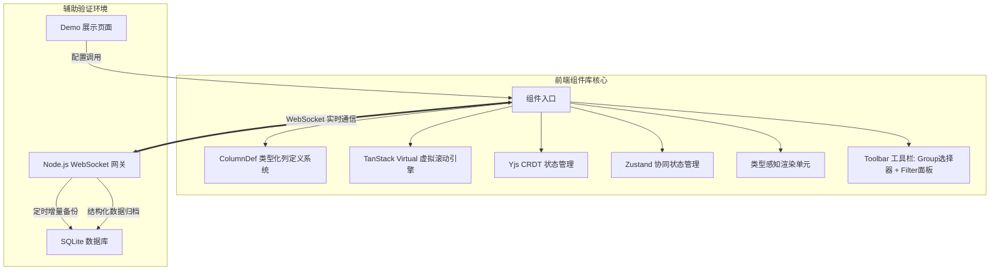
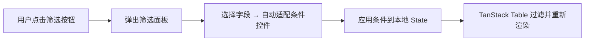
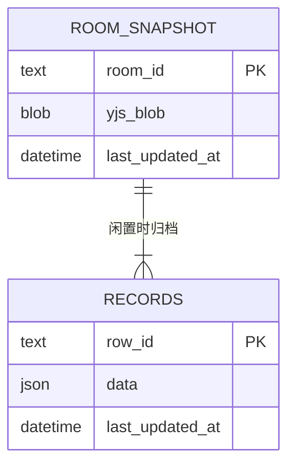

# 高性能协同 DataTable 架构设计文档

## A1. 需求分析与系统边界
本项目的核心产出为一套 **高复用、高性能的协同 DataTable React 组件库**。为确保开发阶段能够验证网络通信与并发合并逻辑，项目包含一个轻量级的 **Demo 验证后端**。架构上对二者进行了明确的职责划分。



---

## A2. 技术栈选型

### 【组件库】 核心技术栈
*   **表格逻辑引擎**: **TanStack Table (v8)**。Headless 架构，处理排序、过滤和分组逻辑。
*   **长列表渲染**: **@tanstack/react-virtual**。配合动态行高测量，确保 5000 行数据下的滚动性能。
*   **状态管理**: **Zustand**。管理协同光标等高频更新数据，通过 Selector 实现细粒度更新。
*   **协同算法引擎**: **Yjs**。基于 CRDT 算法实现无冲突并行编辑。

### 【辅助沙盒】 Demo 后端技术栈
*   **通信服务**: **Node.js + ws**。原生 WebSocket 实现数据交换与房间管理。
*   **数据存储**: **SQLite**。存储二进制快照和结构化业务数据。

---

## A3. 核心设计：列类型系统 (ColumnDef) *(新增)*

列类型系统是组件 API 的核心，所有列定义由外部宿主通过 Props 传入，组件内部不预设任何业务列。

### A3.1 类型定义

```typescript
type ColumnType = 'string' | 'number' | 'enum' | 'date';

interface ColumnDef {
  id: string;                    // 字段标识，对应数据中的 key
  header: string;                // 列头显示名
  type: ColumnType;              // 数据类型
  width?: number | string;       // 列宽（可选）

  // 编辑控制
  editable?: boolean;            // 是否可编辑，默认 true
  cellEditor?: (ctx: EditorContext) => React.ReactNode;  // 自定义编辑器（DT-C6）

  // 视图控制
  sortable?: boolean;            // 是否可排序，默认 true
  groupable?: boolean;           // 是否可作为分组字段，默认 true
  filterable?: boolean;          // 是否可作为筛选字段，默认 true

  // enum 专属
  enumOptions?: { label: string; value: string; color?: string }[];

  // number 专属
  numberRange?: { min?: number; max?: number; step?: number };

  // date 专属
  dateFormat?: string;           // 如 'YYYY-MM-DD'
}

interface EditorContext {
  rowData: Record<string, any>;
  columnDef: ColumnDef;
  value: any;
  onCommit: (val: any) => void;
  onCancel: () => void;
}
```

### A3.2 类型驱动行为映射

| 类型 | 查看态渲染 | 编辑态控件 | 筛选控件 | 排序方式 |
|---|---|---|---|---|
| `string` | 文本 | `<input type="text">` | 文本包含/不包含 | 字典序 |
| `number` | 数字（可格式化） | `<input type="number">` | 范围滑块（min/max） | 数值排序 |
| `enum` | Badge/Tag 标签 | `<Select>` 下拉 | 多选 Checkbox | 按 option 顺序 |
| `date` | 格式化日期 | DatePicker | 日期范围 | 时间戳排序 |

---

## A4. 核心设计：高级筛选系统 *(新增)*

### A4.1 单条件筛选（P0）
用户在工具栏点击"筛选"按钮，弹出筛选面板：
1. 选择目标字段（仅显示 `filterable: true` 的列）
2. 根据列类型自动渲染对应的条件控件
3. 应用筛选条件到本地 State，不触发网络同步

### A4.2 多条件组合筛选（P1）
支持添加多个筛选条件，条件之间的逻辑关系默认为 AND，可切换为 OR。



---

## A5. 核心设计：卡片式分组 *(新增)*

### A5.1 交互设计
*   分组控件位于顶部工具栏，以下拉选择器形式呈现（仅显示 `groupable: true` 的列）。
*   支持最多两层嵌套分组（如先按 `status` 再按 `priority`）。
*   分组后表头列保持不变，不受分组影响。

### A5.2 视觉设计
*   每个分组渲染为一个独立的视觉卡片区块：
    * 卡片标题栏：显示分组字段名 + 值 + 记录数，支持折叠/展开
    * 卡片内部：标准表格行布局
    * 卡片之间：8-16px 间距作为视觉分隔
*   嵌套分组时，子分组卡片以缩进形式嵌套在父分组内。

### A5.3 虚拟化兼容
分组卡片的标题栏和内容行均参与虚拟化计算。标题栏作为特殊的"虚拟行"插入到行列表中，确保滚动性能不受分组数量影响。

---

## A6. 核心设计：组件内部控制逻辑

*   **`<ReactiveCell />` 类型感知渲染**:
    单元格组件根据 `ColumnDef.type` 自动选择查看态渲染方式和编辑态控件。当 `cellEditor` 有自定义值时优先使用自定义编辑器。
*   **视图状态隔离 (Local State)**:
    排序、筛选、分组等 UI 状态存储在 React 本地状态中，不参与网络协同同步。
*   **结构化更新机制**:
    数据更新通过行 UUID 直接操作底层的 `row.original` 对象，确保排序/过滤后依然能精确命中目标。

---

## A7. Demo 数据持久化方案



## A8. 辅助功能接口规范

**1. WebSocket 接入**
*   `WS /api/sandbox-ws/{roomId}` — 原生 Yjs Uint8Array 状态同步

**2. 内部持久化触发**
*   每 1 分钟自动执行热快照备份
*   房间闲置 5 分钟自动执行结构化归档
